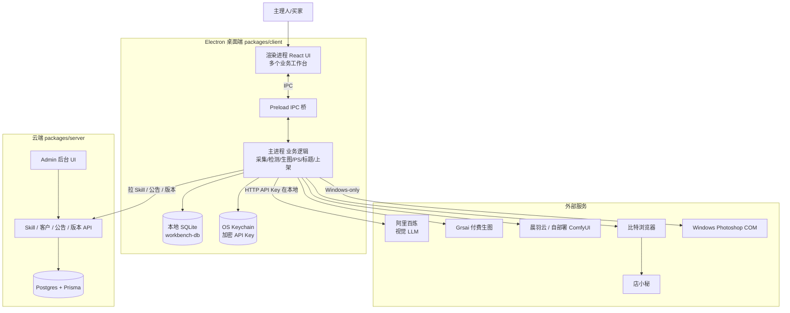
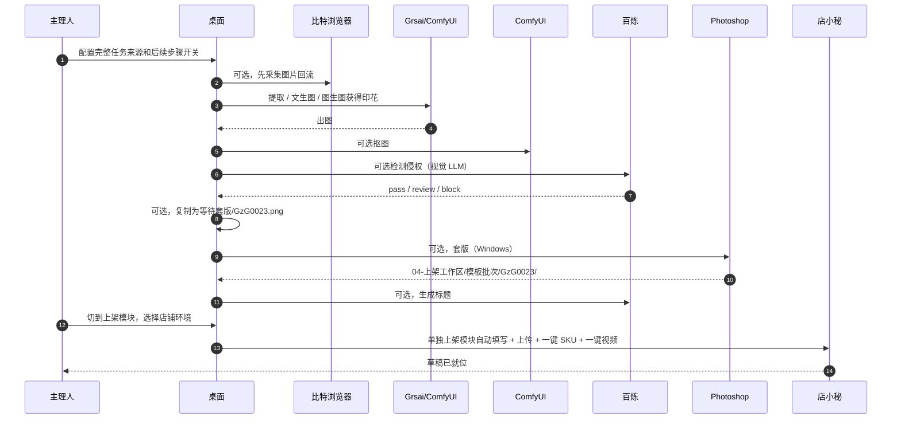
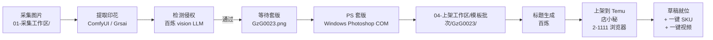
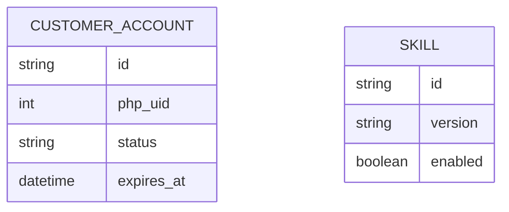

# 项目导览（PROJECT_TOUR）

> 给项目主理人自己看的回神文档。不是给团队的规范，也不是给用户的说明书。
> 最后更新：2026-06-05

---

## 一句话讲项目

这是一个 **腾域 aipod 跨境电商桌面工作台**，解决 **"从看到一张好图、到把它上架到 Temu/Shein"这一整条手工链路效率太低** 的问题。

就像一个 **"自动美工流水线"**：你给它准备来源，它可以顺着采集/生图 → 抠图 → 检测侵权 → PS 套版 → 写标题跑完；最后再交给上架模块读 `04-上架工作区` 去店小秘上架。

---

## 当前进度速览

| 切片 | 模块 | 状态 | 备注 |
|---|---|---|---|
| 0 | 工程骨架 | ✅ 已完成 | monorepo / Electron / Next.js / CI |
| 1 | 首次设置与本地配置 | ✅ 已完成 | v0.1.0，工作区选择 + API Key 本地保存 + Skill 缓存 |
| 2 | 标题生成 | ✅ 已完成 | v0.2.0，百炼 + Skill 缓存 |
| 3 | 侵权检测 | ✅ 已完成 | v0.3.0，百炼视觉 LLM |
| 4 | 生图 Grsai | ✅ 已完成 | v0.4.0，付费 API |
| 5 | 生图 ComfyUI | ✅ 已完成 | v0.5.0，晨羽云 + 自部署 |
| 6 | 采集 | ✅ 已完成 | v0.6.0，比特浏览器 + CDP |
| 7 | PS 套版 | ✅ 已完成 | v0.7.0，Windows-only |
| 8 | 上架 | ✅ 已完成 | Temu + Shein |
| 完整任务 | ✅ 最初版 | 来源 → 可选抠图 → 可选检测 → 可选等待套版 → 可选 PS → 可选标题；不含上架 |
| v1.0 全链路 | 真实验收 | 🟡 待跑通 | **主理人本机** |
| v1.5 | 增量 | ⬜ 未启动 | i18n / 多平台 / 通用编排 / 签名 |

> 依据：`.trellis/tasks/archive/2026-05/` 下 91 个 task 已归档，git log 显示切片 1-8 feat+archive 双 commit 完整。

---

## 整体架构图



**用大白话讲一遍**：桌面 app 是工具人（实际干活），服务器是"客户账号授权与提示词控制台"（管理员账号、客户授权、Skill 系统提示词、公告、版本），不碰模型配置、图片和 Key，也不保存 PHP `secret`。用户的 API Key 一律放在自己电脑的钥匙串里，**不上服务器**。

---

## 一次全链路验收流程（完整任务 + 单独上架）



---

## 4 个业务工作区（最重要的业务约定）

代码反复围着这 4 个目录转。**只放业务图片，不放 json/csv/jsx**（唯一例外：上架批次里的标题 xlsx，当前优先 `标题.xlsx`，兼容旧 `titles.xlsx`）。

```
~/腾域aipod工作台/
├─ 01-采集工作区/      ← 比特浏览器采集回来，按平台和时间分任务目录
├─ 02-印花工作区/      ← 文生图/图生图/提取/抠图，按任务子目录保存出图
├─ 03-检测工作区/      ← 百炼判定后按无风险/疑似/高风险分类
└─ 04-上架工作区/      ← PS 输出 + 标题 + 上架输入（上架唯一读取域）
```

`02-印花工作区` 下面固定四个能力目录：`文生图` / `图生图` / `提取` / `抠图`。每次运行会在能力目录下再建一个 `{任务名}` 文件夹，默认“能力-时间”，前端可自定义；“提取后抠图”入口的最终图归入 `抠图` 目录。完整任务进入 PS 前会额外写 `等待套版/{runId}/`，里面是按印花货号命名的最终印花副本。

---

## 业务模块详解：每个功能的代码在哪

> 这一节就是你最想看的"模块定位地图"。

### 1️⃣ 采集模块 — 从店小秘 / Temu / Shein 抓图回本地

| 部分 | 文件 |
|---|---|
| **主进程业务** | `packages/client/src/main/lib/collection-image-index-service.ts` ← 图池扫描/下载/商品页主图分组<br/>`collection-session-manager.ts` ← 会话状态机 + debug-log 事件<br/>`collection-click-service.ts` ← 点击模式<br/>`collection-injected-script.ts` ← 注入到页面的采集脚本<br/>`collection-record-store.ts` ← 采集记录 + manifest |
| **浏览器接入** | `bit-browser-client.ts` ← 比特浏览器 HTTP API<br/>`cdp-client.ts` ← Chrome DevTools Protocol<br/>`browser-profile-lock.ts` ← profile 互斥（不变规则 #5） |
| **UI 工作台** | `packages/client/src/renderer/src/features/collection/CollectionPage.tsx` ← 图池采集界面 + 日志弹窗<br/>`image-pool.ts` ← 散图/商品页分组<br/>`collection-debug-log.ts` ← 命令行式日志格式化 |
| **相关归档 task** | `.trellis/tasks/archive/2026-05/05-23-collection-*`、`05-27-fix-collection-remaining-issue`、`05-28-collection-debug-log-panel` |

### 2️⃣ 检测模块 — 用百炼视觉 LLM 判断是否侵权

| 部分 | 文件 |
|---|---|
| **主进程业务** | `packages/client/src/main/lib/detection-service.ts` ← 检测编排 + IPC<br/>`detection-config.ts` ← 阈值 / 模型配置<br/>`aliyun-bailian-adapter.ts` ← 阿里百炼 API 适配 |
| **UI 工作台** | `packages/client/src/renderer/src/components/detection-workbench.tsx` |
| **Spec** | `docs/spec/04-detection.md` |
| **相关归档 task** | `detection-module-service` / `module-ui` / `cost-estimator` / `thresholds` / `promote-to-matting` / `e2e` |

### 3️⃣ 生图模块 — 按入口组织，ComfyUI 选择运行云机

当前 UI 只把**文生图**收敛成统一页：提示词生成、自己写提示词、提示词审稿共用，右侧“生图路径”选择 Grsai 或 ComfyUI 工作流，默认 Grsai。**图生图不合并**，Grsai 图生图和 ComfyUI 图生图继续按原入口走；ComfyUI 图生图可按每张参考图设置一次生成数量，另有 ComfyUI-only 的“提取后抠图”入口。

| 部分 | 文件 |
|---|---|
| **统一编排** | `packages/client/src/main/lib/generation-service.ts` ← 主调度 + `generation:debug-log` 运行期日志事件<br/>`generation-concurrency.ts` ← 并发控制（共享给所有 provider）<br/>`prompt-generator-service.ts` ← 提示词生成（百炼） |
| **Grsai 路径**（付费） | `grsai-adapter.ts`（节点切换 / 重试 / 异步轮询） |
| **ComfyUI 路径** | `comfyui-instance-manager.ts` ← 实例生命周期<br/>`comfyui-chenyu-adapter.ts` ← 晨羽智云<br/>`comfy-http-client.ts` ← HTTP 直连<br/>`chenyu-cloud-client.ts` ← 晨羽 API<br/>`comfyui-workflow-cache.ts` ← 工作流缓存 |
| **晨羽设置** | `SettingsPage.tsx` ← API Key 连接状态、固定杭州慎思 POD 创建、全部实例开关机、设为默认云机 |
| **图像预处理** | `preprocess-pool.ts` |
| **UI 工作台** | `packages/client/src/renderer/src/components/generation-workbench.tsx` ← 生图主界面 + 日志弹窗<br/>`packages/client/src/renderer/src/features/generation/generation-debug-log.ts` ← 命令行式日志格式化 |
| **Spec** | `docs/spec/03-generation.md` |
| **相关归档 task** | `grsai-adapter` / `generation-*` / `comfyui-*` / `chenyu-cloud-adapter` / `txt2img-*` / `img2img-*` / `extract-*` / `matting-*` |

ComfyUI 路径页面显示运行云机选择卡：运行状态、云机下拉框、实例 UUID、ComfyUI 地址和刷新按钮。开机、关机、设为默认云机仍在设置页处理。

生图页顶部的“日志”按钮打开运行期日志弹窗，实时显示提示词生成、任务提交、模型调用进度、完成/失败和保存路径。它只保存在前端内存中，最近 `1000` 条，重启后清空。

### 4️⃣ PS 套版模块 — Windows-only，真实 Photoshop COM

| 部分 | 文件 |
|---|---|
| **主进程业务** | `packages/client/src/main/photoshop/com-adapter.ts` ← COM 桥<br/>`execution-engine.ts` ← 执行引擎（多模板批次 + 跳过已完成）<br/>`multi-batch.ts` ← 任务分组<br/>`psd-scanner.ts` ← PSD 模板扫描<br/>`psd-template-cache.ts` ← 模板缓存<br/>`jsx-generator.ts` ← 生成 ExtendScript<br/>`status-checker.ts` ← Photoshop 进程检测<br/>`ipc.ts` ← IPC 入口 |
| **共享类型** | `packages/shared/src/photoshop.ts`、`photoshop-grouping.ts` |
| **UI 工作台** | （PS 模块 UI 在 App.tsx 注册，文件未单独抽出）|
| **Spec** | `docs/spec/05-photoshop.md` + `docs/adr/0007-photoshop-windows-only-v1.md` |
| **守护变量** | `REAL_PS=1` / `REAL_PS_MUTATE=1` / `PS_MATERIAL_ROOT` / `PS_OUTPUT_ROOT` |
| **相关归档 task** | `ps-*`（12 个，含 `psd-scanner` / `ps-com-adapter` / `ps-execution-engine` / `ps-clipping` 等） |

### 5️⃣ 标题生成模块 — 用百炼生成 + Skill 缓存

| 部分 | 文件 |
|---|---|
| **主进程业务** | `packages/client/src/main/lib/title-service.ts`<br/>`skill-cache.ts` ← 云端 Skill 系统提示词缓存 |
| **UI** | 集成在生图 / 检测工作台 |
| **Spec** | `docs/spec/06-title.md` |

### 6️⃣ 上架模块 — 唯一独立成模块的业务（按 SKILL 四层）

| 部分 | 文件 |
|---|---|
| **入口编排** | `packages/client/src/modules/listing/runner.ts` ← 任务驱动<br/>`evidence.ts` ← 截图存证<br/>`packages/client/src/main/lib/listing-batch-loader.ts` ← 扫 04-上架工作区 |
| **Temu 平台**（四层严格分） | `modules/listing/platforms/dianxiaomi-temu-pop/`<br/>　├─ `selectors.ts` ← DOM 选择器（静态）<br/>　├─ `page-parser.ts` ← 读 DOM 返状态<br/>　├─ `action-executor.ts` ← 动作原语（5 项核心动作）<br/>　└─ `workflow.ts` ← 12 阶段业务流程 |
| **Shein 平台**（同四层） | `modules/listing/platforms/dianxiaomi-shein/` 下同名 4 文件 |
| **共享类型** | `packages/shared/src/listing-types.ts` |
| **UI 工作台** | `packages/client/src/renderer/src/components/listing-workbench.tsx` |
| **Spec** | `docs/spec/07-listing.md` + `docs/adr/0004-listing-direct-port-with-rewrite.md` |
| **守护变量** | `REAL_LISTING=1` / `REAL_LISTING_MUTATE=1` |
| **相关归档 task** | `listing-skill-import` / `profile-lock` / `types-port` / `runner-port` / `temu-*` / `shein-*` / `batch-loader` / `resume` / `evidence` / `module-ui` / `failure-retry` / `module-e2e` |

### 7️⃣ 完整任务 — 固定流程首版，不是自由编排器

| 部分 | 文件 |
|---|---|
| **主进程业务** | `packages/client/src/main/lib/pipeline-service.ts` ← 复用生图 / 检测 / PS / 标题 runner 串起来<br/>`pipeline-policy.ts` ← 抠图默认值、检测放行和步骤计划策略 |
| **UI 工作台** | `packages/client/src/renderer/src/features/pipeline/FullTaskPage.tsx` |
| **共享类型** | `packages/shared/src/types.ts` 中 `Pipeline*` 类型 |
| **关键边界** | 不包含上架；启用 PS 时才必须填印花货号并要求 Windows；只支持取消，不支持暂停/恢复；关闭 PS 后 macOS 可运行前置步骤 |
| **ADR** | `docs/adr/0012-complete-task-initial-fixed-pipeline.md` + `docs/adr/0013-complete-task-explicit-stage-toggles.md` |

启用 PS 套版时，完整任务里的印花货号就是等待套版图片名和套版后货号文件夹名。比如填 `GzG0023`，最终单张印花会先复制成 `02-印花工作区/等待套版/{runId}/GzG0023.png`，PS 输出就是 `04-上架工作区/{模板批次}/GzG0023/`。
完整任务页当前是“上方配置、下方结果”：印花产物按预计数量预留槽位，完成一张显示一张；侵权检测结果按本次通过要求分为通过和未通过；日志按钮展示最近 `1000` 条完整任务运行期日志。

### 8️⃣ 客户登录、首次设置与云端 Skill — 授权先行，本地保存密钥

| 部分 | 文件 |
|---|---|
| **主进程业务** | `packages/client/src/main/lib/customer-auth.ts` ← 旧 PHP 登录 + Next 授权门禁<br/>`packages/client/src/main/lib/server-base-url.ts` ← 客户端后端地址解析（开发态默认云端）<br/>`packages/client/src/main/onboarding.ts` ← 首次设置 + 工作区/API Key 保存<br/>`packages/client/src/main/lib/onboarding-state.ts` ← setup 状态<br/>`keychain.ts` ← OS 钥匙串加密 |
| **后台** | `packages/server/src/app/admin/admins/`（管理员账号管理）<br/>`packages/server/src/app/admin/customers/`（客户账号授权）<br/>`packages/server/src/app/api/customer-auth/`（客户授权校验）<br/>`packages/server/src/lib/php-auth.ts`（旧 PHP 登录态校验封装）<br/>`packages/server/src/app/admin/skills/`（Skill 系统提示词） |
| **Spec** | `docs/spec/08-server.md` + `docs/spec/09-cross-cutting.md` + `docs/adr/0011-customer-login-via-php-auth.md` |

### 公共基础设施（所有模块共用）

| 文件 | 干什么 |
|---|---|
| `packages/client/src/main/lib/temp-file-manager.ts` | 临时文件管理（24h 清理，不变规则 #10） |
| `packages/client/src/main/lib/workbench-config.ts` | 工作台配置 |
| `packages/client/src/main/lib/workbench-db.ts` | SQLite 元数据 |
| `packages/shared/src/errors.ts` | `AppError` 错误结构 |
| `packages/shared/src/schemas.ts` | IPC zod 校验 |
| `packages/shared/src/types.ts` | 业务类型 |
| `packages/shared/src/constants.ts` | 路径常量 / 模块常量 |

### 服务端（Admin 后台）

| 路径 | 干什么 |
|---|---|
| `packages/server/src/app/admin/admins/` | 管理员账号管理 |
| `packages/server/src/app/admin/customers/` | 客户账号授权管理 |
| `packages/server/src/app/api/customer-auth/` | 客户授权校验 |
| `packages/server/src/app/admin/skills/` | 生图、提取、侵权检测固定 Skill 系统提示词槽位 |
| `packages/server/src/app/api/skills/` | 客户端拉取 Skill 系统提示词 |
| `packages/server/src/app/api/health/` | 服务健康检查 |
| `packages/server/prisma/schema.prisma` | 数据库表结构 |

**当前服务端部署入口**：

- `docker-compose.server.yml`：服务器拉源码后，本机构建 server 镜像
- `docker-compose.image.yml`：服务器只拉预构建镜像，不在服务器上构建源码
- `.env.server.example`：生产环境变量模板

---

## 数据怎么流的（一个真实例子）

举例：上架一个 Temu 服装货号 `GzG0023`。



**5 个流转规则**（任意一条违反 = 出 bug）：
1. 采集输出只进 `01-采集工作区/{platform}-{timestamp}/`
2. 生图输出只进 `02-印花工作区/{能力}/{任务名}/`
3. 检测输出只进 `03-检测工作区/{任务名}/{无风险|疑似|高风险}/`
4. `04-上架工作区/` 是 PS 输出、标题写入和上架读取的唯一业务域
5. 服务端从不接触图片 / API Key（ADR-0003 红线）；同一比特浏览器 profile 同时刻最多 1 个模块占用

---

## 数据库长什么样

**桌面端 SQLite（本地，不上服务器）**：

| 表（概念） | 干什么 |
|---|---|
| `workbench_config` | 工作区路径 / 本地配置 |
| `print_artifact` | 印花 ID 全局唯一（不变规则 #9） |
| `detection_result` | 检测历史 |
| `generation_record` | 生图记录 |
| `collection_record` | 点击/滚动会话采集记录 + manifest（图池结果不写入该表） |
| `listing_task` / `listing_stage` | 上架任务 + 12 阶段状态 |
| `ps_job` | PS 套版任务 |
| `pipeline_runs` / `pipeline_steps` | 完整任务首版运行记录和步骤状态 |

**服务端 Postgres（云端，只放客户账号授权、Skill、公告和版本）**：



Skill 作为云端提示词资源单独管理；本地模型配置、Workflow 和平台规则都留在客户端侧。

---

## 我现在该看哪几个文件

按"快速回神"的顺序：

1. `AGENTS.md` / `CLAUDE.md` — 项目协作规则 + 当前阶段
2. `ROADMAP.md` — 108 task 总路线图 + 切片划分
3. `docs/CONTEXT.md` — 领域语言（货号 / 印花 / Skill / 工作区）
4. `docs/spec/00-overview.md` — 整体架构 + **11 条不可违反规则**
5. `CHANGELOG.md` — 切片 1-8 与完整任务最初版已交付能力

---

## 下一步建议

基于"切片 0-8 + 完整任务最初版代码完成、v1.0 还未真实跑通"这个现状：

1. ⚠️ **必须做**：主理人本机跑一次真实全链路验收（完整任务跑到标题 → 上架模块读取 `04-上架工作区` → 店小秘 `2-1111` 草稿就位），用 1 个真实来源 + 真实 PSD + 真实店小秘账号。这是 v1.0.0 放行的唯一卡点。
2. ✅ **可以推进**：在等真实验收时，可以并行做 `v15-sign-mac` / `v15-sign-windows`（代码签名），这是发版给朋友试用的前提
3. 🤔 **要决策**：v1.5 的通用编排引擎和 i18n 哪个先做。建议**签名先做、通用编排和 i18n 等真实用户反馈再排**。

---

## 相关文档

- **总路线图**：[ROADMAP.md](../ROADMAP.md)
- **AI 协作规则**：[CLAUDE.md](../CLAUDE.md)
- **领域语言**：[docs/CONTEXT.md](CONTEXT.md)
- **产品需求**：[docs/PRD.md](PRD.md)
- **整体架构 + 11 条不变规则**：[docs/spec/00-overview.md](spec/00-overview.md)
- **14 个 ADR（关键架构决策）**：[docs/adr/](adr/)
- **CHANGELOG**：[CHANGELOG.md](../CHANGELOG.md)
